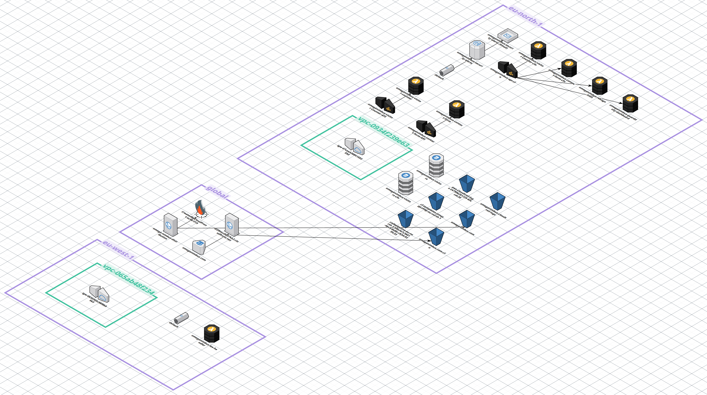

# OmegaNimbus

**Production-grade AWS cloud security portfolio, built from scratch, documented day by day.**

🌐 [omeganimbus.com](https://omeganimbus.com) · 👤 [Albert Sicart](https://linkedin.com/in/albertsicart) · Cloud Security Engineer · Barcelona

---

## Architecture

**Regions:** eu-north-1 (Stockholm) · eu-west-1 (Ireland) · Global  
**Stack:** S3 · CloudFront · Route 53 · Lambda · API Gateway · DynamoDB · SES · GuardDuty · CloudTrail · Security Hub · EventBridge · SNS · CloudFormation · CodePipeline · Rekognition · Bedrock · Amazon Lex V2

---

## Live Features

| Feature | URL | Stack |
|---|---|---|
| Portfolio | [omeganimbus.com](https://omeganimbus.com) | S3 + CloudFront + Route 53 |
| Threat Dashboard | [/security.html](https://omeganimbus.com/security.html) | GuardDuty + Lambda + API Gateway |
| Image Analysis | [/rekognition.html](https://omeganimbus.com/rekognition.html) | Rekognition + Bedrock |
| Study Notes | [/notes.html](https://omeganimbus.com/notes.html) | S3 + CloudFront |
| AI Assistant | Chat widget (all pages) | Amazon Lex V2 + Lambda |

---

## Roadmap

### Day 1 — Static Hosting + CDN + TLS ✅
*01-05-2026*

S3 static website hosting, CloudFront distribution with custom domain, ACM certificate (us-east-1), HTTPS redirect, SES identity verification, Lambda + API Gateway contact form.

### Day 2 — IAM, DynamoDB & CI/CD Pipeline ✅
*02-05-2026*

IAM least privilege roles for each Lambda, DynamoDB visitor counter, CodePipeline connected to GitHub via GitHub App. Deploy time: ~7 seconds per push.

### Day 3 — Security Monitoring & Infrastructure as Code ✅
*03-05-2026*

GuardDuty enabled, CloudTrail with KMS encryption, Security Hub with AWS Foundational Security Best Practices + CIS AWS Foundations. Full stack migrated to CloudFormation (15 resources managed as code).

### Day 4 — Automated Alerting & Threat Dashboard ✅
*04-05-2026*

EventBridge rule triggering SNS email alerts on GuardDuty findings (severity ≥ 4). Real-time GuardDuty dashboard on `security.html` — Lambda + API Gateway querying findings live.

### Day 5 — Computer Vision & AI Image Analysis ✅
*05-05-2026*

Rekognition pipeline (detect_labels, detect_text, detect_faces) + Amazon Bedrock Claude Haiku 4.5 for AI-generated image descriptions. Live at `omeganimbus.com/rekognition.html`.

### Day 6 — Conversational AI Assistant ✅
*06-05-2026*

Amazon Lex V2 bot with 6 custom intents covering skills, projects, certifications, and contact. Lambda handler invoking Lex runtime, `POST /chat` endpoint on existing API Gateway. Floating chat widget integrated across all portfolio pages.

### Day 7 — Route 53 + FinOps ✅
*07-05-2026*

Full DNS migration from DonDominio to Route 53. Hosted Zone, A Alias + CNAME records, nameserver cutover — zero downtime. AWS Budgets alarm ($10/month) + Cost Anomaly Detection activated.

### Day 8 — CloudWatch + AWS Config ✅
*08-05-2026*

CloudWatch dashboards with real metrics: API Gateway latency, Lambda errors, DynamoDB read/write capacity. Alarms configured. AWS Config enabled with baseline compliance rules.

### Day 9 —  S3 Lifecycle + VPC ✅
*09-05-2026*

S3 versioning and lifecycle policies on the main bucket. Custom VPC with public and private subnets, security groups, route tables, and NAT Gateway. Lambda functions moved inside the VPC. Core SAA-C03 networking concepts applied to production infrastructure.

### Day 10 — WAF + Shield + GuardDuty Improvements ✅
*10-05-2026*
AWS WAF on CloudFront with rate limiting and geo-blocking rules. Shield Standard review. GuardDuty sample findings generator integrated into the security dashboard.

### Day 11 — Security Monitoring Stack & Cloud Observability ✅
*11-05-2026*
EC2-based monitoring stack with Prometheus, Grafana, and on-demand activation via Lambda + EventBridge. ALB with HTTPS termination exposing Grafana at siem.omeganimbus.com (not a real siem, yet). CloudWatch observability layer with CloudTrail, GuardDuty, and a centralized Security Operations dashboard.

---

## Upcoming

### Day 12 — RDS + DynamoDB Streams
Relational database layer with RDS. DynamoDB Streams with reactive Lambda — event-driven architecture pattern.

---

## Stack Reference

| Layer | Service | Region |
|---|---|---|
| DNS | Route 53 | Global |
| CDN | CloudFront | Global |
| Storage | S3 | eu-north-1 |
| Compute | Lambda | eu-north-1 / eu-west-1 |
| API | API Gateway HTTP API | eu-north-1 |
| Database | DynamoDB | eu-north-1 |
| Email | SES | eu-north-1 |
| IaC | CloudFormation | eu-north-1 |
| CI/CD | CodePipeline | eu-north-1 |
| Threat Detection | GuardDuty | eu-north-1 |
| Audit | CloudTrail + KMS | eu-north-1 |
| Compliance | Security Hub | eu-north-1 |
| Alerting | EventBridge + SNS | eu-north-1 |
| Computer Vision | Rekognition | eu-west-1 |
| AI | Bedrock (Claude Haiku 4.5) | eu-west-1 |
| Conversational AI | Amazon Lex V2 | eu-west-1 |
| Cost Control | Budgets + Cost Anomaly Detection | Global |

---

## Writeups

Technical documentation for each build session is available in the [`/writeups`](./writeups) directory.

---

*Albert Sicart · [omeganimbus.com](https://omeganimbus.com) · [github.com/AlbertSicart](https://github.com/AlbertSicart) · [linkedin.com/in/albertsicart](https://linkedin.com/in/albertsicart)*
